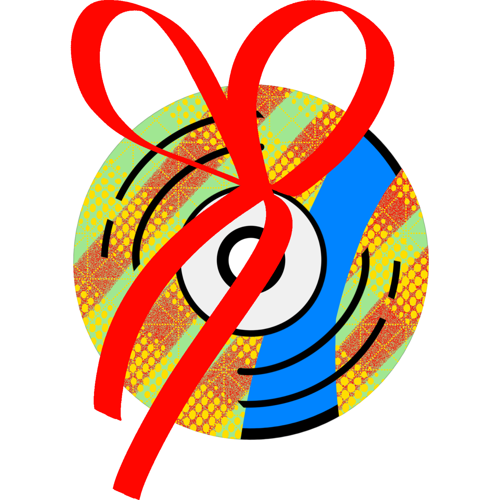
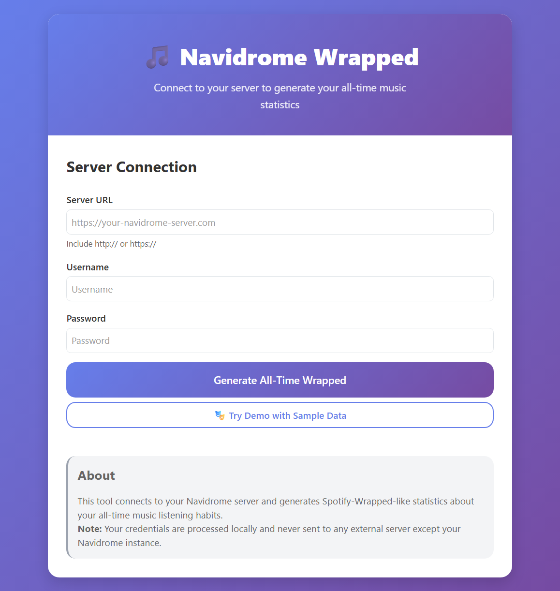
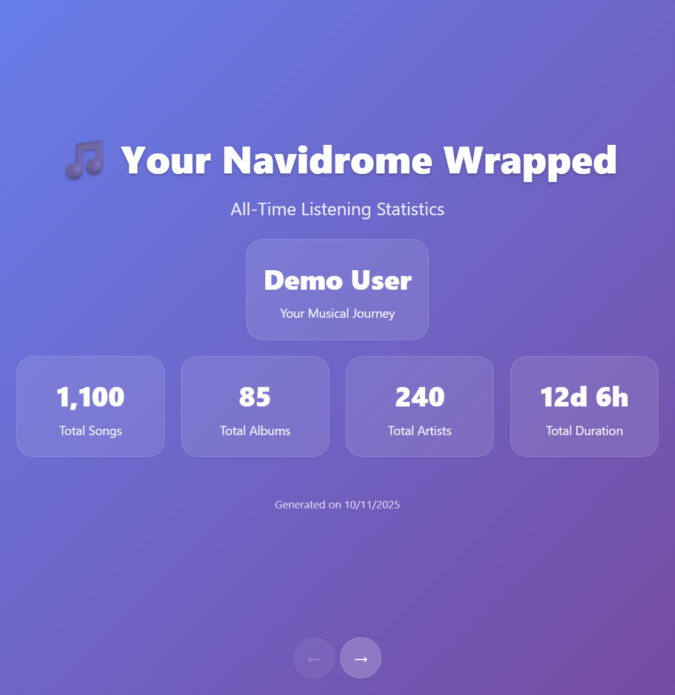
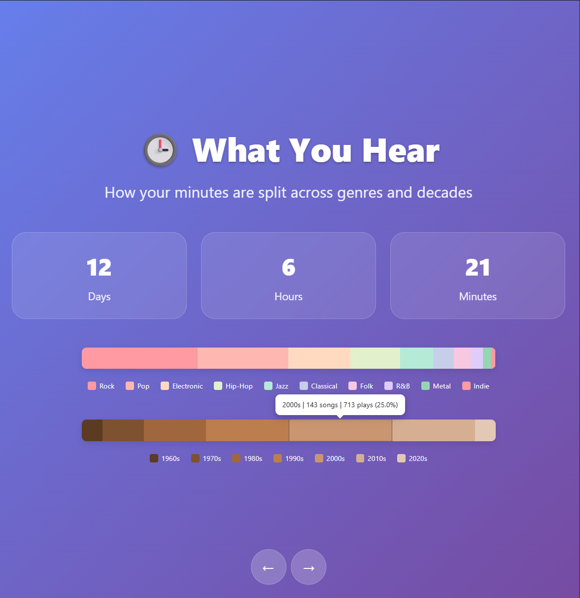

#  Navidrome Wrapped 

A beautiful, Spotify Wrapped-inspired web application that generates comprehensive listening statistics from your Navidrome music server. Visualize your all-time music habits with interactive charts, top lists, and shareable summaries.

🔗 [Live Site](https://mdeik.github.io/Navidrome-Wrapped/)

*Connect to your Navidrome server to get started*

## ✨ Features

- **Comprehensive Analytics**: Track listening time, top artists, albums, songs, and genres
- **Interactive Visualizations**: Beautiful charts showing your music distribution across genres and decades
- **Diversity Scoring**: Measure how varied your listening habits are
- **Rating Analysis**: See how you rate music and discover patterns
- **Shareable Cards**: Generate beautiful 9:16 share cards of your stats
- **Privacy-First**: Everything runs locally in your browser
- **Demo Mode**: Try it out with sample data before connecting your server

*Interactive slideshow presentation of your music stats*

## 🔧 Technical Implementation

### Architecture
- **Pure Client-Side**: No backend server required - runs entirely in the browser
- **Responsive Design**: Mobile-first CSS with custom design tokens and fluid typography
- **Modern JavaScript**: ES6+ classes with modular architecture
- **Local Storage**: Caches your results for 90 days for quick revisits

### API Integration
The app connects directly to your Navidrome server using the Subsonic API:
- Secure authentication via token-based API calls
- Progressive data loading with real-time progress updates
- Efficient pagination for large music libraries
- Error handling for connection issues

### Privacy & Security
- **Local Processing**: All data processing happens in your browser
- **No Data Storage**: Credentials are never stored or transmitted to external servers
- **Direct API Calls**: Communication only with your specified Navidrome instance
- **Transparent Code**: Open-source implementation you can audit

## 🚀 Quick Start

1. **Clone or Download** the project files
2. **Open `index.html`** in a modern web browser
3. **Enter your Navidrome server details**:
   - Server URL (include http:// or https://)
   - Username
   - Password
4. **Click "Generate All-Time Wrapped"** and watch your stats come to life!

*Or try the **demo mode** to see sample data without connecting to a server*

## 🛠 Skills Demonstrated

This project showcases modern web development practices including:
- **Frontend Architecture**: Modular JavaScript with class-based components
- **API Design**: Clean abstraction layer for Navidrome Subsonic API
- **UI/UX Design**: Responsive layouts with CSS custom properties and design tokens
- **Data Visualization**: Interactive charts and progress indicators
- **Performance**: Efficient data handling and lazy loading techniques
- **Security**: Client-side encryption and secure API communication

## 📊 Sample Data Sections

- **Welcome Overview**: Library size and basic stats
- **Listening Time**: Genre and decade breakdowns with interactive charts
- **Top Artists/Albums/Songs**: Ranked lists with play counts and progress bars
- **Diversity Analysis**: How evenly you listen across artists
- **Rating Habits**: Distribution of your song ratings
- **Audio Quality**: Bitrate and format analysis for audiophiles
- **Summary**: Key highlights and shareable moments

*Interactive genre and decade distribution charts*

## 🔒 Privacy Notice

Your privacy is respected:
- Credentials are used only to generate an API token for your session
- All music data processing occurs locally in your browser
- No information is sent to any server except your Navidrome instance
- You can verify this by reviewing the open-source code
